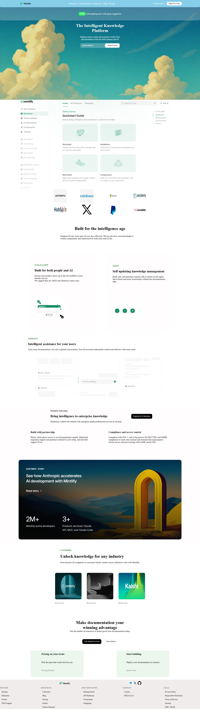

# CSS-Project-Mintlify-Page
# Mintlify Homepage UI Clone (Desktop-Focused)
  This project is a desktop-focused UI recreation inspired by the official Mintlify developer tool website. It was built using pure HTML and CSS as part of a frontend practice assignment.

  The aim of the project was to analyze and reproduce a modern SaaS landing page design, paying close attention to layout structure, spacing, typography choices, and color balance. Rather than functionality, the focus is entirely on visual accuracy and clean styling.

  Reference Site - https://www.mintlify.com/

  ## 📸 Screenshots

### Homepage Preview



## 📋 Assignment Guidelines

This project was developed in accordance with the provided frontend assignment criteria:

✔️ Designed with a desktop-first approach

✔️ Built using only HTML and CSS

✔️ No JavaScript used

✔️ No CSS frameworks or libraries (including Tailwind)

✔️ No animations or interactive effects

✔️ Code written manually without AI-generated snippets

✔️ Emphasis on visual structure and layout accuracy

✔️ Styling inspired by the Mintlify website design

✔️ Implemented as a fully static page


## 🛠️ Tech Used

- HTML5 (Semantic Markup)
- CSS3 (Grid & Flexbox Layout)
- No External Libraries
- No JavaScript

 


## 📂 Project Structure

```text
CSS-Project-Mintlify-Page/
│
├── index.html
├── style.css
├── assets/
└── README.md